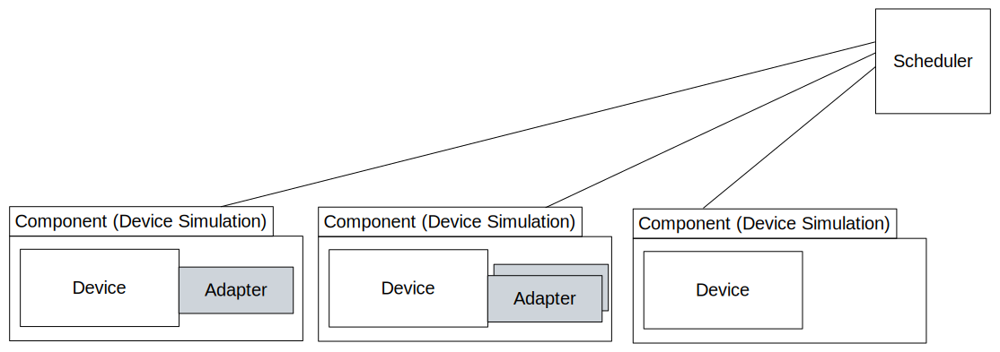
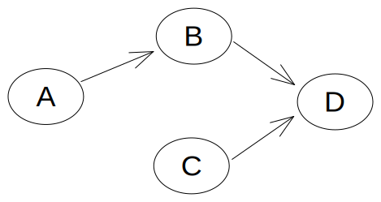

:html_theme.sidebar_secondary.remove:

.. include:: ../README.rst
    :end-before: when included in index.rst

 
How the documentation is structured
-----------------------------------

The documentation is split into 2 sections:

.. grid:: 2

    .. grid-item-card:: :material-regular:`person;4em`
        :link: user/index
        :link-type: doc

        The User Guide contains documentation on how to install and use python3-pip-skeleton.

    .. grid-item-card:: :material-regular:`code;4em`
        :link: developer/index
        :link-type: doc

        The Developer Guide contains documentation on how to develop and contribute changes back to python3-pip-skeleton.

.. toctree::
    :hidden:

    user/index
    developer/index