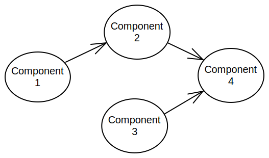

.. include:: ../README.rst
    :end-before: when included in index.rst

.. |overview| image:: images/tickit-simple-overview.svg

 
How the documentation is structured
-----------------------------------

Documentation is split into four categories, accessible from links in the side-bar.

.. rst-class:: columns

Tutorials
~~~~~~~~~

Tutorials for installation, library and commandline usage. New users start here.

.. toctree::
    :caption: Tutorials
    :hidden:

    tutorials/installation
    tutorials/running-a-simulation
    tutorials/creating-a-simulation
    tutorials/creating-a-device
    tutorials/creating-an-adapter

.. rst-class:: columns

How-to Guides
~~~~~~~~~~~~~

Practical step-by-step guides for the more experienced user.

.. toctree::
    :caption: How-to Guides
    :hidden:

    how-to/accomplish-a-task

.. rst-class:: columns

Explanations
~~~~~~~~~~~~

Explanation of how the library works and why it works that way.

.. toctree::
    :caption: Explanations
    :hidden:

    explanations/glossary
    explanations/how-component-updates-are-ordered

.. rst-class:: columns

Reference
~~~~~~~~~

Technical reference material, for classes, methods, APIs, commands, and contributing to the project.

..
    Index link below is a hack to make genindex.html a relative link
    https://stackoverflow.com/a/31820846

.. toctree::
    :caption: Reference
    :hidden:

    reference/api
    reference/contributing
    Changelog <https://github.com/dls-controls/tickit/blob/master/CHANGELOG.rst>
    Index <genindex.html#http://>

.. rst-class:: endcolumns

About the documentation
~~~~~~~~~~~~~~~~~~~~~~~

`Why is the documentation structured this way? <https://documentation.divio.com>`_
