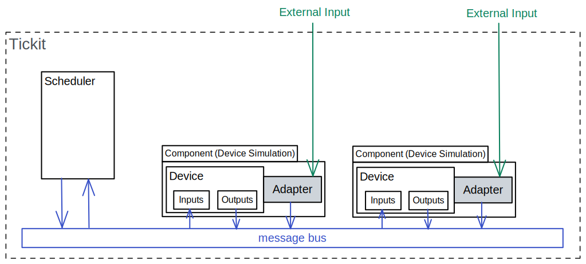

Framework Summary
=================

Tickit is an event-based simulation framework allowing for the simulation of
complex mutli-device systems.

A tickit simulation consists of a scheduler and components, all of which
communicate via a message bus. The scheduler keeps simulation time running and
updates the components in the simulation when requested.

Components
^^^^^^^^^^
Components are typically comprised of :doc:`devices <devices>`_ and :doc:`adapters <adapters>`_. Devices are created
as required to provide the necessary simulated the behaviour, and adapters are
interfaces between devices and any external input. Adapters allow us to
influence the device from outside the simulation, such as using a TCP client to
alter a parameter on a device.

Scheduler
^^^^^^^^^
The scheduler orchestrates the running of the simulation. It is what is *run* in
a simulation and primarily encapsulates the ticker.

The scheduler is instantiated with :doc:`wiring <wiring>`_ from the config
file used to start up the simulation. See tutorial :doc:`creating a simulation. <../tutorials/creating-a-simulation>`_
With this wiring the scheduler knows which components are connected together and
therfore how to propogate messages and updates through the system.

The **ticker** contains the logic for the propogation of updates through the system.
When a component requests an update, either by a callback or an interupt, the
ticker updates that component then propogates the update to any component
downstream.

Running a simulation
--------------------

What does it mean to be running a simulation?
What causes a device update?
What does it mean for a device to update?

The scheduler runs the simulation time until one of the devices requests an
update. This can be either due to a device callback or an interupt.

