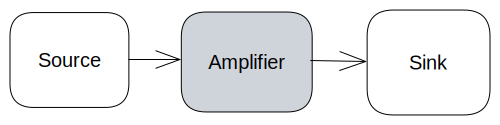

Creating a Device
=================

This tutorial shows how to create a simple amplifier `Device` for use in the tickit
framework. This device will act as a simple amplifier which can multiply the signal
recieved.

Device Class
------------

We shall begin by defining the amplifier class, which inherits `Device`.

.. code-block:: python

    from tickit.core.device import Device

    class AmplifierDevice(Device):

As stated in :doc:`devices<../explanations/devices>`, a new device must have an
update method which returns a device update, and must have ``Input`` and ``Output``
maps as members. As such we shall put in the following boilerplate.

.. code-block:: python

    from typing_extensions import TypedDict

    from tickit.core.device import Device, DeviceUpdate
    from tickit.core.typedefs import SimTime

    class AmplifierDevice(Device):

    Inputs: TypedDict = TypedDict("Inputs", {})
    Outputs: TypedDict = TypedDict("Outputs", {})

    def __init__(self) -> None:

    def update(self, time: SimTime, inputs: Inputs) -> DeviceUpdate[Outputs]:

        return DeviceUpdate(self.Outputs(), None)

Device Constructor and Configuration
------------------------------------

Next, we shall populate the ``__init__`` method, allowing for the device to be
instantiated. For this amplifier we want an amplification of 2, so we assign that
here.

.. code-block:: python

    from typing_extensions import TypedDict

    from tickit.core.device import Device, DeviceUpdate
    from tickit.core.typedefs import SimTime

    class AmplifierDevice(Device):

    Inputs: TypedDict = TypedDict("Inputs", {})
    Outputs: TypedDict = TypedDict("Outputs", {})

    def __init__(self, initial_amplification: float = 2) -> None:
            self.amplification = initial_amplification

    def update(self, time: SimTime, inputs: Inputs) -> DeviceUpdate[Outputs]:

        return DeviceUpdate(self.Outputs(), None)

Device Logic
------------

In order to have a signal to amplifier we will make the following small system
where the amplifier recieves a signal from a `source` and outputs it to a `sink`.
The `sink` and `source` are already available in ``tickit.devices``.

The core logic of the device will be implemented in the ``update`` method, which
recieves the simulation time and any Inputs into the device. We want to recieve
an input signal from the source, amplify it, and output it to our sink. As such
we define our inputs and outputs in the maps, and the line of logic in the ``update``.

.. code-block:: python

    from typing_extensions import TypedDict

    from tickit.core.device import Device, DeviceUpdate
    from tickit.core.typedefs import SimTime

    class AmplifierDevice(Device):

        Inputs: TypedDict = TypedDict("Inputs", {"initial_signal":float})
        Outputs: TypedDict = TypedDict("Outputs", {"amplified_signal":float})

        def __init__(self, initial_amplification: float = 2.0) -> None:
            self.amplification = initial_amplification

        def update(self, time: SimTime, inputs: Inputs) -> DeviceUpdate[Outputs]:
            amplified_value = inputs["initial_signal"] * self.amplification
            return DeviceUpdate(self.Outputs(amplified_signal=amplified_value), None)

Creating a ComponentConfig
--------------------------

In order to run the Device as a simulation, it requires a `ComponentConfig` that 
knows how to instantiate that Device. This will be defined in the same file as the
device, and defines any default initial configuration values. As well as this, we
overwrite the magic method `__call__()`, which returns a `DeviceSimulation` object.
This object takes the component name, as well as it's device. We will return to this
if the device requires any adapters to control it externally.

.. code-block:: python

    from dataclasses import dataclass

    from tickit.core.components.component import Component, ComponentConfig
    from tickit.core.components.device_simulation import DeviceSimulation

    @dataclass
    class Amplifier(ComponentConfig):
        initial_amplification: float

        def __call__(self) -> Component:
            return DeviceSimulation(
                name=self.name,
                device=AmplifierDevice(
                    initial_amplification=self.initial_amplification,
                ),
            )

Using the Device
----------------

In order to use the device we must first create a simulation configuration yaml
file. This file will be used to set up our simulation and will consist of: a 
`Source`, named source, which will produce a constant input signal; our amplifier;
and a `Sink`, named sink, which will recieve the amplified signal.

.. code-block:: yaml

    - tickit.devices.source.Source:
        name: source
        inputs: {}
        value: 10.0
    - amp.Amplifier:
        name: amp
        inputs:
        initial_signal: source:value
        initial_amplification: 2.0
    - tickit.devices.sink.Sink:
        name: sink
        inputs:
        input: amp:amplified_signal

Where in ``amp.Amplifier`` ``amp`` is the name of the ``.py`` file the amplifier
is written in, and Amplifier is the name of the `ComponentConfig` for the amplifier.

.. seealso::
    See the :doc:`Creating a Simulation<../tutorials/creating-a-simulation>` tutorial for a walk-through of creating simulation
    configurations.

Finally, to run the simulation:

.. code-block:: bash

    python -m tickit all amp_conf.yaml

Once run, we expect to see an output akin to:

.. code-block:: bash

    DEBUG:asyncio:Using selector: EpollSelector
    DEBUG:tickit.core.management.ticker:Doing tick @ 0
    DEBUG:tickit.core.components.component:source got Input(target='source', time=0, changes=immutables.Map({}))
    DEBUG:tickit.devices.source:Sourced 10.0
    DEBUG:tickit.core.management.schedulers.base:Scheduler got Output(source='source', time=0, changes=immutables.Map({'value': 10.0}), call_at=None)
    DEBUG:tickit.core.components.component:amp got Input(target='amp', time=0, changes=immutables.Map({'initial_signal': 10.0}))
    DEBUG:tickit.core.management.schedulers.base:Scheduler got Output(source='amp', time=0, changes=immutables.Map({'amplified_signal': 20.0}), call_at=None)
    DEBUG:tickit.core.components.component:sink got Input(target='sink', time=0, changes=immutables.Map({'input': 20.0}))
    DEBUG:tickit.devices.sink:Sunk {'input': 20.0}
    DEBUG:tickit.core.management.schedulers.base:Scheduler got Output(source='sink', time=0, changes=immutables.Map({}), call_at=None)

We can see that we input a signal of 10, and it is amplified to a signal of 20.

.. seealso::
    See the :doc:`Running a Simulation<../tutorials/running-a-simulation>` tutorial for a walk-through of running a simulation
    in a single or across multiple processes.

Interact with the device
------------------------

Now we have a device it is likely we want to interact with it. This can be achieved
externally using adapters. A guide on how to do this can be found :doc:`here.<use-composed-adapter>`