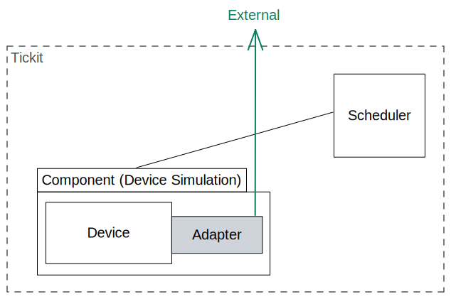

Making a simple device simulation
=================================

This tutorial shows a user how to create a very simple device and run it in its
own simulation.

In this tutorial we will: 
    
#. `Create a new device`_
#. `Attach an adapter to the device`_
#. `Create the component for the device and adapter`_
#. `Write the config yaml file to run the simulation`_

Following these steps will result in the following simulated system:

Create a new device
-------------------

Any new device created must: be of type device, have an update method, and must
have **Inputs** and **Outputs** maps as members. In this tutorial we will not
be connecting the device to any other, it will be running in isolation. As a
result the the Inputs and Outputs of this device will be empty, however they
must still be present in the device class.

Initially we set up the boilerplate.

.. code-block:: python

    from tickit.core.device import Device, DeviceUpdate
    from tickit.core.typedefs import SimTime
    from tickit.utils.compat.typing_compat import TypedDict

    class IoCountingDevice(Device):

    #: An empty typed mapping of device inputs
    Inputs: TypedDict = TypedDict("Inputs", {})
    #: A typed mapping containing the current output value
    Outputs: TypedDict = TypedDict("Outputs", {})

    def __init__(self) -> None:

    def update(self, time: SimTime, inputs: Inputs) -> DeviceUpdate[Outputs]:
        return DeviceUpdate(IoBoxDevice.Outputs(), None)

This device we have called IoBoxDevice currently does nothing. It takes no
inputs, provides no outputs and has no attributes that are initialised. Since
we need a device to do something we will make it recieve messages and store it
(until a new one comes along). To do so we can give it an attribute **message**
that is initialised as "Hello".

.. code-block:: python

    from tickit.core.device import Device, DeviceUpdate
    from tickit.core.typedefs import SimTime
    from tickit.utils.compat.typing_compat import TypedDict

    class IoCountingDevice(Device):

    #: An empty typed mapping of device inputs
    Inputs: TypedDict = TypedDict("Inputs", {})
    #: A typed mapping containing the current output value
    Outputs: TypedDict = TypedDict("Outputs", {})

    def __init__(self, inital_value: str = "Hello") -> None:
        self.message = inital_value

    def update(self, time: SimTime, inputs: Inputs) -> DeviceUpdate[Outputs]:
        return DeviceUpdate(IoBoxDevice.Outputs(), None)

Say for some reason we are also interested in how many times the device has
been updated overall. We can do this by initalising another class attribute
**update_count** and having it incremented everytime the device is updated.

.. code-block:: python

    from tickit.core.device import Device, DeviceUpdate
    from tickit.core.typedefs import SimTime
    from tickit.utils.compat.typing_compat import TypedDict

    class IoCountingDevice(Device):

    #: An empty typed mapping of device inputs
    Inputs: TypedDict = TypedDict("Inputs", {})
    #: A typed mapping containing the current output value
    Outputs: TypedDict = TypedDict("Outputs", {})

    def __init__(self, inital_value: str = "Hello") -> None:
        self.message = inital_value
        self.update_count = 0

    def update(self, time: SimTime, inputs: Inputs) -> DeviceUpdate[Outputs]:
        self.update_count = self.update_count + 1
        return DeviceUpdate(IoBoxDevice.Outputs(), None)

For more complicated behaviour you can put logic in the update method and even
call other class functions to manipulate the attributes of the device however
is needed. See the included example devices as a guide.

Now we need a way to give our device a message, we can do so with an adapter.

Attach an adapter to the device
-------------------------------

An adapter facilitaties interactions between a device and components external
to the simulation. In this tutorial this will be a TCP client. We will therfore
use a `ComposedAdapter` which will recieve messages as strings over TCP.

The `ComposedAdapter` delegates the hosting of an external messaging protocol
to a server, and message handling to an interpreter. The required interpreter
and server are initialised with the adapter. Here we want to use a TCP server
and a `CommandInterpreter`. We can keep the server generic for now, but provide
the `CommandInterpreter`. 

.. code-block:: python

    from tickit.adapters.composed import ComposedAdapter
    from tickit.adapters.interpreters.command import CommandInterpreter
    from tickit.core.adapter import Server

    class IoCountingAdapater(ComposedAdapter):
        device: IoCountingDevice

        def __init__(self, server: Server) -> None:
            super().__init__(
                server,
                CommandInterpreter(),
            )

The `CommandInterpreter` interprets messages recived by the server using regex
commands to check the message is something the device wants to handle. We will
allow ours to recieve very general messages. See the code below:

.. code-block:: python

    from tickit.adapters.composed import ComposedAdapter
    from tickit.adapters.interpreters.command import CommandInterpreter
    from tickit.core.adapter import Server

    class IoCountingAdapater(ComposedAdapter):
        device: IoCountingDevice

        def __init__(self, server: Server) -> None:
            super().__init__(
                server,
                CommandInterpreter(),
            )

        @RegexCommand(r"m=([a-zA-Z0-9_!.?-]+)", interrupt=True, format="utf-8")
        async def set_message(self, value: str) -> None:
            self.device.message = value

        @RegexCommand(r"m\?", format="utf-8")
        async def get_message(self) -> bytes:
            return str(self.device.message).encode("utf-8")

Here we have created two commands that our interpreter can read, one for setting
and one for getting the message. See the following line:

.. code-block:: python

    @RegexCommand(r"m=([a-zA-Z0-9_!.?-]+)", interrupt=True, format="utf-8")

with this line we can see that any message recieved which preceedes with **m=**
and contains characters in the above regex capture group will be stored in the
device with `self.device.message = value`.

To then query the device for the message we use the command **m?** and the
server will return the current value of **message** on the device.

Create the component for the device and adapter
-----------------------------------------------

Write the config yaml file to run the simulation
------------------------------------------------